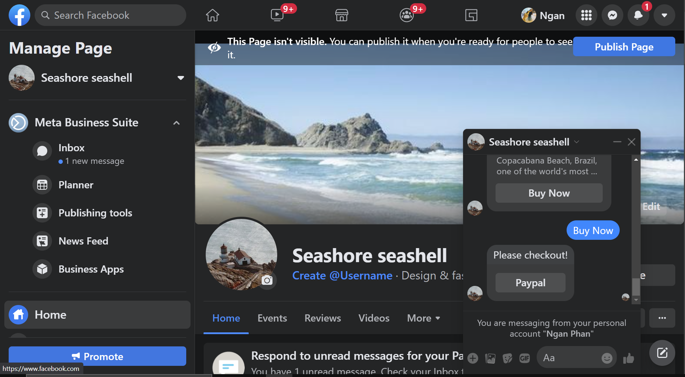
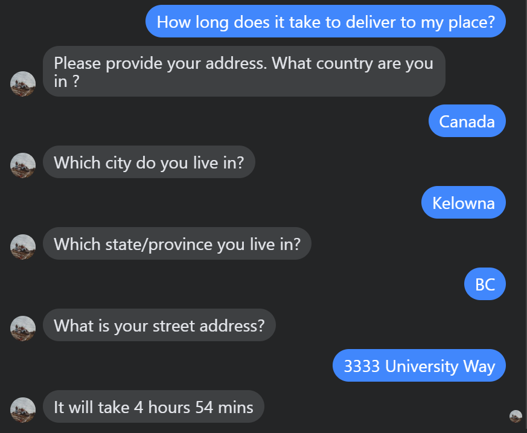
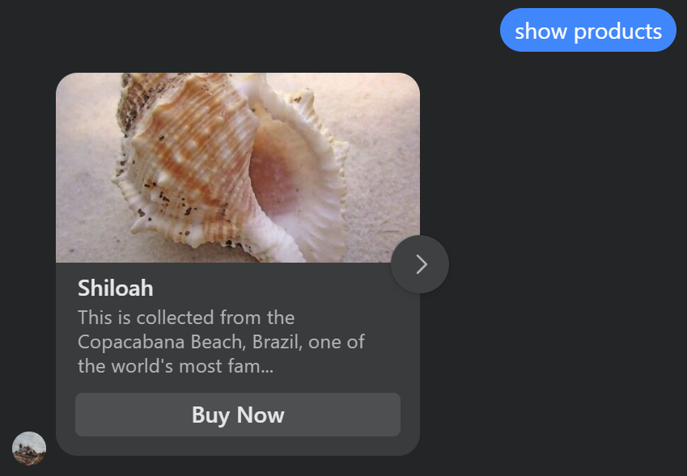
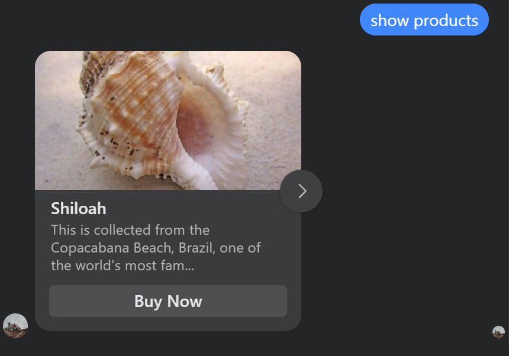
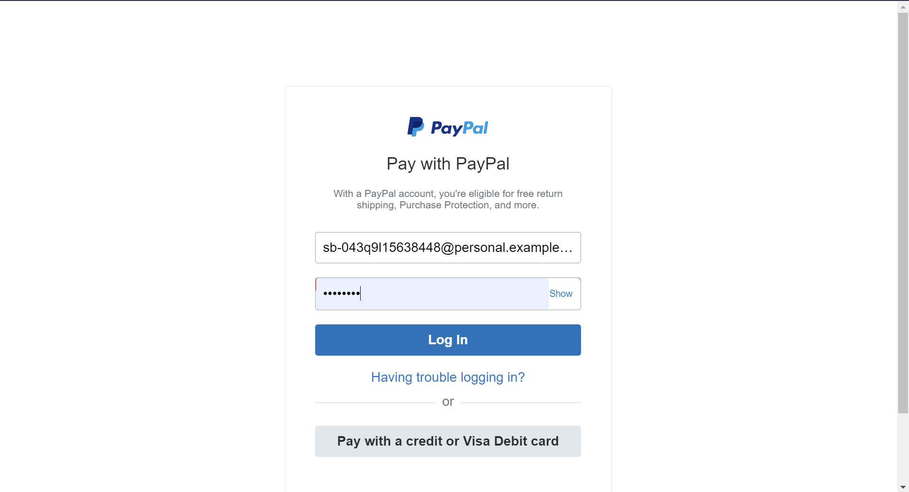
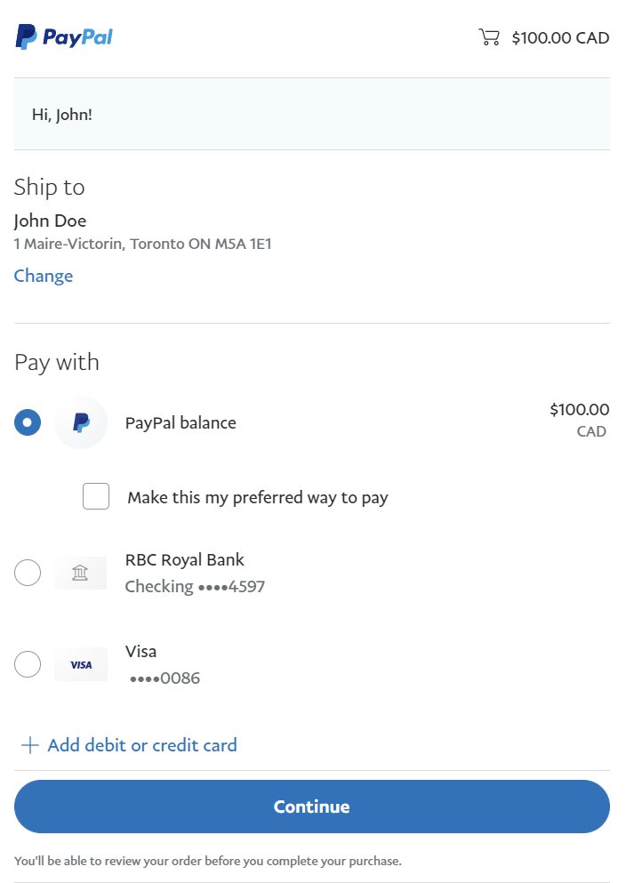
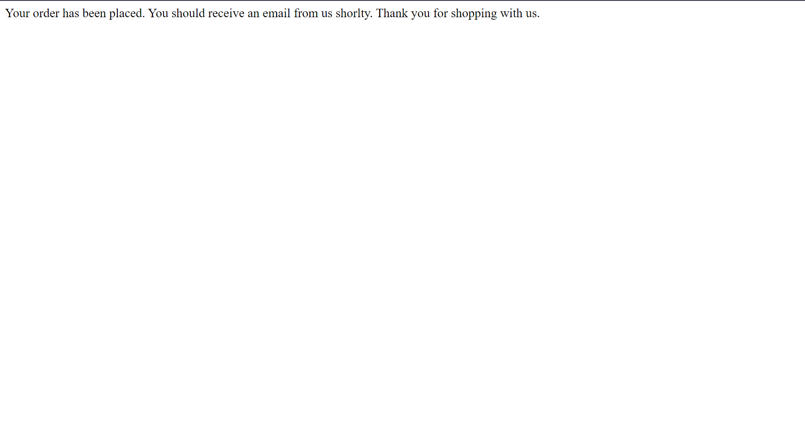

# Store chat bot

Visit this link to chat with the bot:
https://www.facebook.com/Seashore-seashell-103927852293376

###### An assistant chatbot for Seashore seashell that helps answer customer queries.

The chatbot will greet the user, then answer their question about store/product information or other, more complex concerns.

The chatbot will do so by doing a basic check of the user input, and redirecting the query to the appropriate mini-bot, where a more in-depth response will be handled.

## Table of contents

* [Setup](#setup)
  * [Windows](#windows-powershell)
  * [Unix](#unix-bash)
  * [Run Bot](#run)
* [Main Bot (input/output)](#main-bot)
* [Mini Bots (products & store information)](#product--store-mini-bots)
* [Tests](#tests)
  * [All cases](#test-all-cases)
  * [Selected cases](#test-selected-cases)
* [API](#api)
  * [Store Info API](#store-info-api)
  * [Product Info API](#product-info-api)
  * [Database API](#database-api)
* [New Features](#new-features)
  * [User interface](#user-interface)
  * [Distance Matrix API](#estimated-delivery-time)
  * [Product carousel](#product-carousel)
  * [Paypal sandbox](#paypal-checkout)

## Setup

REQUIREMENTS: Facebook Messenger App, Dialogflow agent, Google API Key, Paypal sandbox

1. Create Dialogflow agent and connect it to project on Google console.
Then import the dialogflow-agent.zip to your project. Refer to the first part of this [blog](https://medium.com/janis/a-strategy-for-managing-dialogflow-intents-when-you-want-to-add-context-98665097e758) for more details.
2. Create a Facebook Messenger App and connect it to the Dialogflow agent. Refer to this [blog](https://medium.com/@kiesp/tutorials-how-to-integrate-dialogflow-with-facebook-messenger-f8b9e9fa6a3e)
3. On Goolge console, go to your project and enable ***Distance Matrix API*** and create a Google API Key.
4. Create a Paypal sandbox account and retrieve client_id and secret. Refer to this [blog](https://developer.paypal.com/api/rest/)
5. Set environment variables.

#### Windows (PowerShell)

Creating virtual environment and install dependencies to run the bot:
**Powershell**
```powershell 
python3 -m venv venv
venv\Scripts\activate
$env:API_KEY=<Your key>
$env:client_id=<Your Paypal client id>
$env:secret=<Your Paypal secret>
```

**Command Prompt**
Setting up the environment variables for the bot (Google cloud key) in cmd:
```command prompt
python3 -m venv venv
venv\Scripts\activate
setAPI_KEY=<Your key>
setclient_id=<Your Paypal client id>
setsecret=<Your Paypal secret>
```

#### Unix (Bash)

Creating virtual environment and install dependencies to run the bot:

```bash
./install.sh
```

Setting up the environment variables for the bot (Google cloud key).
```bash
export API_KEY=<Your key>
export client_id=<Your Paypal client id>
export secret=<Your Paypal secret>
```

## Run
```bash
python3 index.py
```

## Overall chat structure

Whenever user sends a message on Facebook messenger, a request containing the message will be sent to Dialogflow agent. Intent of the message is detected by the agent. If the intent is *Default Welcome intent* or *Default Fallback Intent*, Dialogflow will handle it itself and respond to Messenger app. Otherwise, Dialogflow sends another request to our webhook server to handle fullfilment.


## Product & Store Mini-bots

This mini-bot will handle any question related to product price, stock, and store information. The bot first determines what topic is of interest (product or store information) and breaks the user's message down into keywords. The bot then compares these words and checks them in order to create the most appropriate response, and returns the response to the main function.

See in-depth documentation [here](app/products/README.md).

## Tests
We are using `pytest` for all of our tests. Our test cases can be found in the `test` folder.

### Test all cases:
```console
python -m pytest
```

### Test selected cases:

- database
- store_info
- prod_info
- intent_detection

```console
python -m pytest -v -m <selected case>
```

## API
You can call the API from any other Python script to check store's information or products information. This does not require the bot to be running or a diagflow key.

**Make sure to import the API correctly, as the API is not imported by default, and is dependent on your project's file hierarchy.**

### Store Info API

From this bot you can query the store's information.

`Example import for product info bot:`
```console
from app.products.store_info import StoreInfoHandler
```

`handle(string) -> string`
```console
StoreHandler = StoreInfoHandler()
message = "Where is the store?"
output = StoreHandler.handle(message)
# returns string: "It is 123 Main St"
```

`parse(string) -> object`
```console
StoreHandler = StoreInfoHandler()
message = "Where is the store?"
print(StoreHandler.parse(message))
# returns object: {'request': 'address'}
```

### Product Info API

From this bot you can query the store's products information.

`Example import for product info bot:`
```console
from app.products.product_info import ProductInfoHandler
```

`handle(string) -> string`
```console
StoreHandler = ProductInfoHandler()
message = "How much does a banana cost?"
output = StoreHandler.handle(message)
# returns string: "Bananas cost $0.67 per kg."
```

`parse(string) -> object`
```console
StoreHandler = ProductInfoHandler()
message = "How much does a banana cost?"
output = StoreHandler.parse(message)
# returns object: {'request': 'price', 'id': '4011'}
```

### Database API
The database API also allows queries straight from the database.

`Example import for database:`
```console
from app.database import Database
```

`Database lifecycle:`
```console
db = Database.instance()
db.connect()
db.init_database()
# queries or methods
db.close()
```

`get_product("id", str) -> List`
```
output = db.get_product("id", "4011")
# returns list: [OrderedDict([('id', '4011'), ('name', 'banana'), ('names', 'bananas'), ('price', 0.67), ('price_scale', 'per kg'), ('in_stock', True), ('calories', 89), ('protein', '1.1 g'), ('carbs', '22.8 g'), ('sugar', '12.2 g'), ('fat', '0.3 g')])]
```

## New Features
#### User interface
The chatbot is integrated with Facebook Messenger App so it has a new user interface. User can go to *Seashore seashell* page on Facebook and interact with the chatbot through Messenger. With this new UI, it's easier for user to interact with the bot and see media content.

#### Estimated delivery time
When user asks about estimated delivery time from store to their place, the bot will ask for user address. Then it makes a request to Google Distance Matrix API to get the estimated delivery time.

#### Product carousel
On request, the bot will return a carousel of products. Each product will have a button for quick checkout.

#### Paypal checkout
When user hits ***Checkout*** button, another button for Paypal checkout will be shown.


When user hits ***Paypal*** button, they will be directed to Paypal website to complete the payment.





After completing authorization step, the user will be directed to confirmation website. This completes the payment process.


